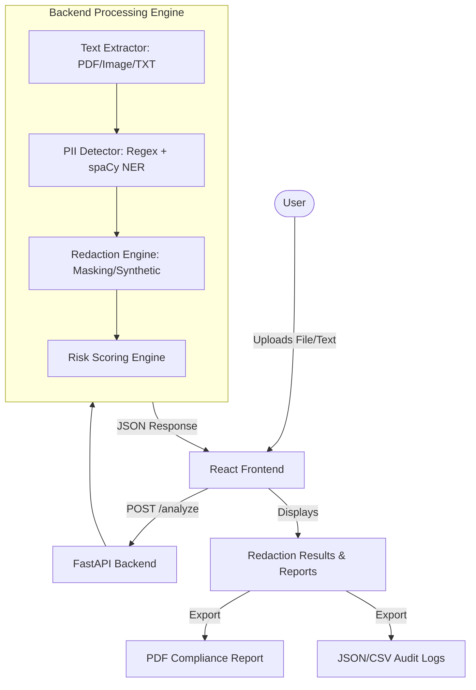

# 🛡️ AI PII Redactor

An enterprise-grade, privacy-first tool to detect and redact Personally Identifiable Information (PII) from public datasets and documents. Built with a high-performance FastAPI backend and a stunning, responsive React frontend.

> [!IMPORTANT]
> **Live Demo**: [https://ai-pii-redactor.vercel.app](https://ai-pii-redactor.vercel.app)
> *(Placeholder link for portfolio demo)*

---

## 🏗️ Architecture



## 🚀 Key Features

- **Multi-Format Support**: Process `.txt`, `.pdf`, and images (OCR capability).
- **Hybrid Detection Engine**:
  - **Regex Layer**: Deterministic detection for Emails, Phone Numbers, Aadhaar (India), PAN (India), SSN (US), and Credit Cards.
  - **NLP Layer (spaCy)**: Statistical detection for Names, Organizations, and Locations.
- **Smart Redaction**: Replace sensitive spans with type-specific placeholders (e.g., `[REDACTED_EMAIL]`) without breaking text flow.
- **Risk Scoring**: Real-time risk assessment based on entity density and sensitivity weights.
- **Advanced Export Options**:
  - **PDF Compliance Report**: Professional summary for GDPR/DPDP audits.
  - **JSON/CSV Reports**: Machine-readable audit logs.
  - **Redacted File**: Download the clean version of your document.

## 🛠️ Tech Stack

### Backend
- **Framework**: FastAPI (Python)
- **NLP**: spaCy (`en_core_web_sm`)
- **OCR**: Pytesseract + OpenCV
- **Document Processing**: PyPDF2, pdfplumber
- **Validation**: Pydantic

### Frontend
- **Framework**: React + Vite + TypeScript
- **Styling**: Tailwind CSS + Shadcn/UI (Glassmorphism design)
- **Icons**: Lucide React
- **State Management**: React Query (TanStack)
- **Notifications**: Sonner

## 📦 Setup & Installation

### 1. Backend Setup
```bash
cd backend
python -m venv venv
.\venv\Scripts\activate  # On Windows
pip install -r requirements.txt
python -m spacy download en_core_web_sm
cp .env.example .env
```

### 2. Frontend Setup
```bash
cd frontend
npm install
```

## 🏃 Running the Project

### Start Backend
```bash
cd backend
.\venv\Scripts\python -m uvicorn main:app --host 127.0.0.1 --port 8000
```

### Start Frontend
```bash
cd frontend
npm run dev
```

## 🔐 Privacy & Security
- **Stateless Architecture**: No files or PII are stored on the server.
- **In-Memory Processing**: Analysis happens in volatile memory.
- **Automatic Deletion**: All uploaded buffers are cleared immediately after the response is sent.

---

## 👨‍💻 Developed By
- **Ch. Chanakya**: Team Lead & System Architecture
- **Ankita**: UI/UX & Frontend Development
- **A. Ashwini**: Backend & OCR Pipeline
